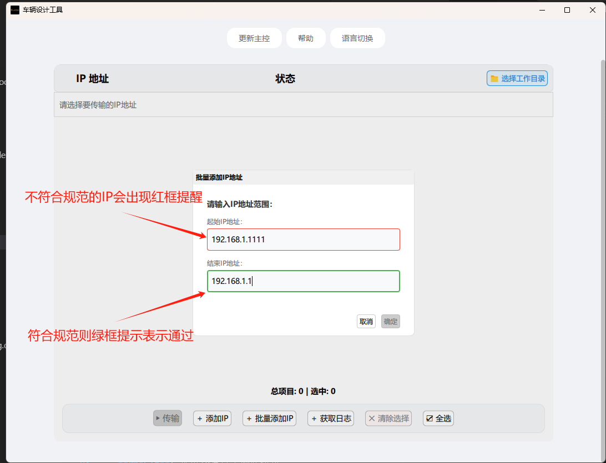

# 车辆设计工具 - IP管理与文件传输指南

## 📡 IP地址管理与文件传输功能使用说明

### 1. IP地址管理

#### 1.1 添加IP地址

软件提供了多种方式添加IP地址：

- **单个IP添加**：点击 "＋ 添加IP" 按钮，可以逐个添加IP地址
- **批量IP添加**：点击 "＋ 批量添加IP" 按钮，支持IP段批量添加

##### 批量添加IP示例


批量添加支持IP范围，例如：
- `192.168.1.1-192.168.1.50`
- `10.0.0.1-10.0.0.100`

> **注意**：批量添加要求同一网段，且IP范围不超过254个地址

#### 1.2 外部文件导入IP

软件支持直接拖入文本文件批量添加IP地址，操作简单快捷：

1. **支持的文件类型**：
   - `.txt` 文本文件
   - `.csv` 逗号分隔值文件

2. **文件格式要求**：
   - 每行一个IP地址
   - IP地址必须符合标准IPv4格式
   - 示例文件内容：
     ```
     192.168.1.1
     192.168.1.2
     192.168.1.3
     ```

3. **导入步骤**：
   - 将准备好的IP地址文件直接拖入软件主界面空白区域
   - 系统将自动识别并添加有效的IP地址
   - 无效的IP地址将被自动过滤


> **提示**：
> - 建议提前检查文件内容，确保IP地址格式正确
> - 拖入文件支持快速批量IP地址导入
> - 系统会自动去重和校验IP地址

#### 1.3 Windows下手动创建IP列表

另外你也可以选择在Windows下创建txt文件：
- 使用记事本（Notepad）创建文本文件
- 每行输入一个IP地址
- 保存为 `.txt` 格式
- 直接拖入软件即可导入

#### 1.4 IP状态检测

- 软件自动进行IP在线状态检测
- 状态指示器颜色说明：
  - 🟢 绿色：设备在线
  - 🔴 红色：设备离线
  - 🟠 灰色：正在检测


### 2. 文件传输

#### 2.1 选择要传输的IP

1. 使用复选框选择需要传输文件的IP地址
2. 可以使用以下按钮辅助选择：
   - "清除选择"：取消所有选择
   - "全选"：选择所有IP地址

#### 2.2 发起文件传输

1. 点击 "▶ 传输" 按钮
2. 在弹出的文件选择对话框中，选择要传输的文件
3. 系统将自动开始文件传输


#### 2.3 传输进度与管理

- 传输进度实时显示
- 支持取消正在进行的传输任务
- 传输完成后自动关闭进度窗口

### 3. 日志获取

#### 3.1 获取远程设备日志

1. 选择需要获取日志的IP地址
2. 点击 "＋ 获取日志" 按钮
3. 选择日志保存目录
4. 系统自动压缩并下载日志文件


### 4. 常见问题

- **无法传输文件**：检查IP地址状态是否为在线
- **传输失败**：确认网络连接和设备认证信息
- **日志获取异常**：检查远程设备日志目录权限

### 5. 安全提示

- 请妥善保管设备登录凭证
- 仅在可信网络环境下进行文件传输
- 定期更新设备登录密码

---

## 📝 版本信息

**当前版本**：1.0.0
