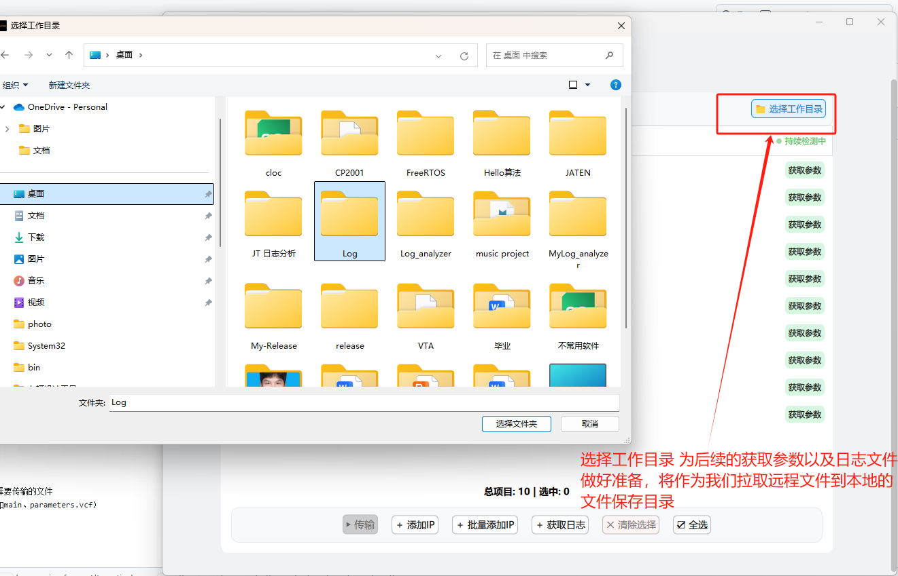

# 车辆设计工具 - IP管理与文件传输指南

## 📋 软件概述

车辆设计工具（VTA）是一个专业的设备管理和文件传输工具，主要提供IP地址管理和文件传输功能。软件采用Qt6框架开发，提供现代化的用户界面和强大的网络传输能力。

### 核心功能
- **IP地址管理**：批量管理设备IP地址，实时状态检测
- **文件传输**：支持文件上传到远程设备，支持日志和参数文件的下载

---

## 📡 IP地址管理功能

### 1. IP地址添加

#### 1.1 单个IP添加
1. 点击 "＋ 添加IP" 按钮
2. 在新增的空行中输入IP地址
3. 系统自动验证IP格式并开始状态检测

#### 1.2 批量IP添加
1. 点击 "＋ 批量添加IP" 按钮
2. 在弹出的对话框中输入起始IP和结束IP
3. 系统会自动识别输入的IP是否符合IPV4规范
4. 点击确定，系统自动添加范围内的所有IP

#### 1.3 文件导入IP
支持直接拖拽文本文件批量导入IP地址：

**支持的文件格式**：
- `.txt` 文本文件
- `.csv` 逗号分隔值文件

**文件格式要求**：
- 每行一个IP地址
- IP地址必须符合标准IPv4格式，且网络号一致
- 示例文件内容：
  ```
  192.168.1.1
  192.168.1.2
  192.168.1.3
  ```

**导入步骤**：
1. 准备包含IP地址的文本文件
2. 将文件直接拖拽到软件主界面空白区域
3. 系统自动识别并添加有效的IP地址
4. 无效的IP地址将被自动过滤

### 2. IP状态管理

#### 2.1 状态检测
- 软件自动进行IP在线状态检测
- 支持持续检测模式，实时更新设备状态
- 状态指示器颜色说明：
  - 🟢 绿色：设备在线
  - 🔴 红色：设备离线
  - 🟠 灰色：正在检测


#### 2.2 IP管理操作
- **编辑IP**：双击IP地址进行编辑
- **清除选择**：取消所有选中的IP
- **全选**：选择所有IP地址

---

## 📁 文件传输功能

### 1. 文件上传

#### 1.1 设置工作目录
1. 点击 "选择工作目录" 按钮
2. 选择本地保存文件的目录
3. 系统会为每个设备创建独立的子文件夹

#### 1.2 选择目标设备
1. 使用复选框选择需要传输文件的IP地址
2. 可以使用以下按钮辅助选择：
   - "清除选择"：取消所有选择
   - "全选"：选择所有IP地址

#### 1.2 发起文件传输
1. 点击 "▶ 传输" 按钮
2. 在弹出的文件选择对话框中选择要传输的文件
3. 系统自动处理文件名标准化（如main、parameters.vcf）
4. 开始文件传输

#### 1.3 传输进度管理
- 实时显示每个设备的传输进度
- 支持取消正在进行的传输任务
- 传输完成后自动关闭进度窗口
- 显示详细的传输状态和错误信息


### 2. 日志下载

#### 2.1 设置工作目录（如果尚未设置）
1. 如果之前没有设置工作目录，点击 "选择工作目录" 按钮
2. 选择本地保存日志的目录
3. 系统会为每个设备创建独立的子文件夹

#### 2.2 获取设备日志
1. 选择需要获取日志的IP地址
2. 点击 "＋ 获取日志" 按钮
3. 系统自动压缩远程设备日志并下载
4. 日志文件保存为 `{IP地址}_logs.zip` 格式

---

## ⚙️ 参数配置功能

### 1. 参数文件获取

#### 1.1 获取单个设备参数
1. 在IP列表中点击对应行的 "获取参数" 按钮
2. 系统自动下载该设备的 `parameters.vcf` 文件
3. 文件保存为 `{IP地址}_parameters.vcf` 格式

#### 1.2 参数文件管理
- 参数文件自动保存到工作目录下的设备子文件夹
- 支持参数文件的查看和编辑

---

## 🔧 高级功能

### 1. 工作目录管理
- **统一文件管理**：所有下载的文件都保存在工作目录中
- **设备子文件夹**：系统为每个设备自动创建独立的子文件夹
- **文件组织**：参数文件和日志文件按设备IP分类存储
- **目录结构示例**：
  ```
  工作目录/
  ├── 192.168.1.100/
  │   ├── 192.168.1.100_parameters.vcf
  │   └── 192.168.1.100_logs.zip
  ├── 192.168.1.101/
  │   ├── 192.168.1.101_parameters.vcf
  │   └── 192.168.1.101_logs.zip
  ```

### 2. 自动重命名
- 上传文件时自动处理文件名标准化
- 支持 `main` 和 `parameters.vcf` 文件的自动重命名
- 自动处理IP前缀的文件名格式

### 3. 错误处理
- 完善的错误提示和状态显示
- 网络连接异常的自动重试
- 文件传输失败的错误恢复

### 4. 文件组织
- 所有下载文件自动保存到工作目录
- 按设备IP地址分类存储
- 支持文件命名规范化和去重

---

## ⚠️ 注意事项

### 1. 网络要求
- 确保与目标设备在同一网络环境
- 检查防火墙设置，确保SSH连接正常
- 建议在稳定的网络环境下进行文件传输

### 2. 权限要求
- 目标设备需要SSH访问权限
- 确保用户具有文件读写权限
- 日志目录需要读取权限

### 3. 文件格式
- IP地址必须符合IPv4标准格式
- 参数文件必须符合VCF格式规范


## 🌐 多语言支持

### 一键中英文切换
- 工具栏右上角提供“语言切换”按钮，点击即可在中文和英文界面间自由切换
- 切换后所有界面文本、按钮、提示信息会自动切换为对应语言
- 无需重启，切换即时生效

---

## 🆘 常见问题

### Q1: 无法连接到设备
**A**: 检查网络连接、防火墙设置

### Q2: 文件传输失败
**A**: 确认设备在线状态、网络连接

### Q3: 日志下载异常
**A**: 检查远程设备日志目录权限和磁盘空间

### Q4: IP地址无法添加
**A**: 确认IP地址格式正确，检查是否重复添加

### Q5: 工作目录设置失败
**A**: 检查目录权限，确保有写入权限，选择有效的本地目录

### Q6: 界面显示异常
**A**: 尝试切换语言或重启软件

---

## 📝 版本信息

**当前版本**：1.0.1  

**主要特性**：
- 基于Qt6框架开发
- 支持中英文双语界面
- 集成SSH文件传输功能
- 现代化用户界面设计

**系统要求**：
- Windows 10/11
- 支持SSH连接的设备
- 稳定的网络环境

---

## 📞 技术支持

如遇到问题或需要技术支持，请联系开发团队。

**更新日志**：
- v1.0.0：初始版本发布，包含IP管理、文件传输等核心功能
